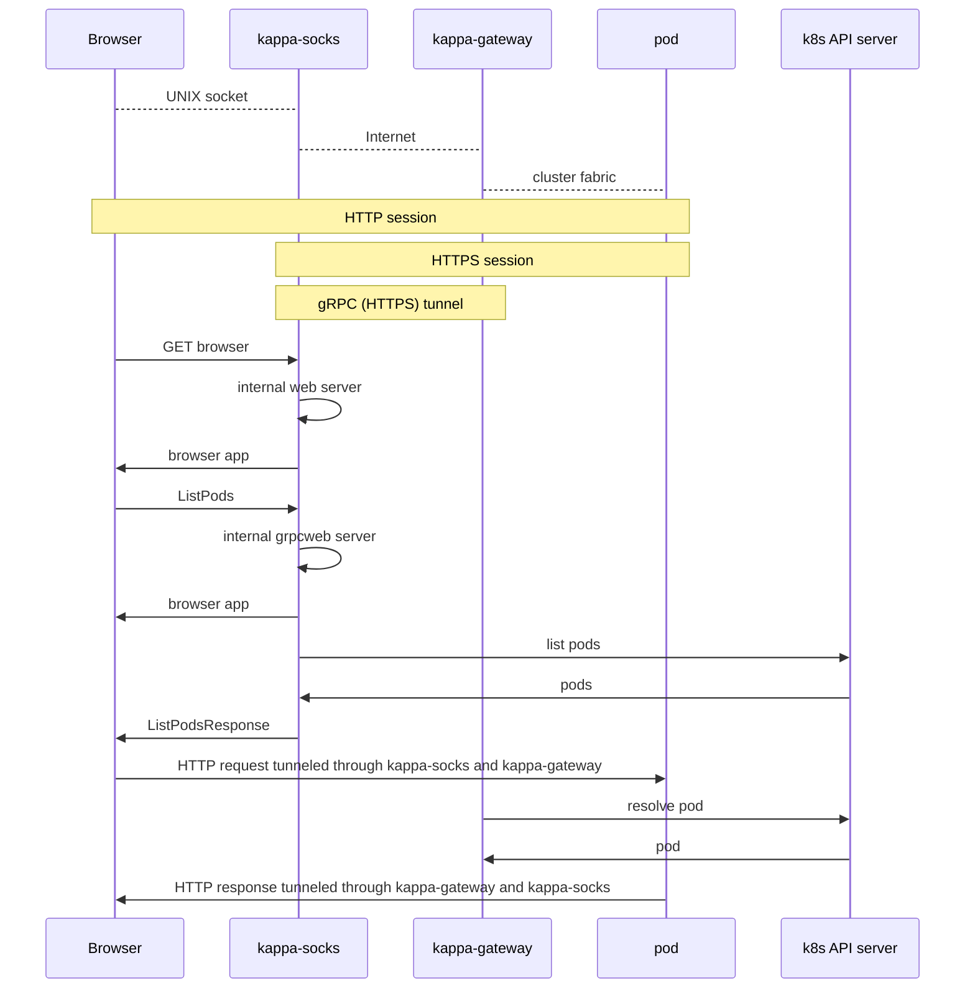

# Kappa

Κ: Kubernetes Access Portal (+2 more words that abbreviate to p.a.)

Or, a piece of software named after a different Greek letter,
not the first one I thought of.

# Purpose

Many of my Kubernetes pods expose useful diagnostic information on HTTP
endpoints, like
[/debug/channels](https://github.com/vandry/comprehensive/blob/4afb297145d38317df5dc0f8b09ca9d6943d206d/comprehensive_warm_channels/src/lib.rs#L27)
and
[/debug/tls](https://github.com/vandry/comprehensive/blob/4afb297145d38317df5dc0f8b09ca9d6943d206d/comprehensive_tls/src/diag.rs)
(or even `/metrics`) and hopefully many more to come. But they are
difficult to consult casually and awkward to use in circumstances of
need, for two reasons:

- They are (intentionally) not publicly exposed (e.g. behing load
  balancers), which usually includes not being reachable where you
  want to debug from.
- There is no sensible TLS identity these endpoints could present:
  - "Normal" WebPKI TLS certificates (with DNSName SANs) don't work
    well because there is no globally canonical DNS name in play.
    The pods only have cluster-internal names. They might serve
    production traffic with WebPKI TLS certificates (e.g. from
    cert-manager), but those will be issued under the public DNS
    name of the service that the pod backs.
  - SPIFFE TLS certificates (with URI SANs) don't work well either
    because browsers don't support them.

Thus we often resort to hacky `kubectl port-forward` for ad-hoc access
which sort of solves the reachability issue except that you have to
point your browser at meaningless `localhost:12345` addresses, and
sidesteps the TLS issue by tunelling the traffic so that you can tolerate
unencrypted HTTP inside the tunnel.

But it's extra steps and also unergonomic.

# Solution

Kappa is a proxy server running on the same machine as the web browser
that will be used for diagnostics. It handles wrapping each connection
to a pod's diagnostics endpoint in TLS and auto-tunneling it into the
cluster. Since access to use the proxy server grants the benefit of
the proxy's credentials (both TLS and Kubernetes API server), the proxy
server only listens on a UNIX domain socket with restricted permissions
so that only a web browser running on the same machine and as the same
user can access it.

Kappa also contains a built-in web server hosting a web application
that serves as its user interface.

# SPIFFE

Kappa is designed to work with [SPIFFE](https://spiffe.io/) TLS credentials,
although it may work with other kinds of TLS credentials. The intended
setup works like this:

1. SPIFFE is deployed in the cluster. Every pod in a distinct security
   equivalence class (I would argue this is more or less every distinct
   replica set such as a deployment or daemonset) gets an identity it
   can present in all its TLS interactions, both when sending RPCs to
   and receiving RPCs from other workloads, and also on diagnostic gRPC
   and HTTP endpoints. Only public web serving interfaces would use
   another (WebPKI) certificate in addition (although this is often
   handled by a dedicated cluster ingress proxy, so most workloads need
   not worry about it).

2. The machines from which you want diagnostic access are also also
   issued SPIFFE identities. These can be from the same Trust Domain as
   the cluster identities, or from a different one if the two are
   federated together.

# How it works



Kappa discovers what diagnostic endpoints are available on each pod by
scanning annotations on the Kubernetes pod objects. It currently looks for
these 2 annotations, although this is likely to change.

| Annotation key   | Meaning                                             |
| ---------------- | --------------------------------------------------- |
| server-diag-port | TCP port number on which a diagnostic server exists |
| server-identity  | URI of identity for diagnostic server must present  |

There is a [notion](https://github.com/spiffe/spiffe/issues/352) that the
SPIFFE org should define a standard cross-application annotation name that
would serve as a better replacement for `server-identity`. As for
`server-diag-port`, a more powerful annotation that might support naming
more than one port and naming the protocol (HTTP, gRPC)each port is expected
to serve might be a good idea.

# Installation

## Prerequisites

The machine on which you will run the browser and `kappa-socks` should already
have API access to the cluster, i.e. `kubectl` should be working.

The same machine should have TLS credentials with trust roots available
that are useful both for:
- authenticating to and verifying kappa-gateway
- verifying TLS of diagnostic endpoints (and authenticating to them if they ask).

For these TLS credentials, SPIFFE is recommended as a standard universal
TLS provider, but Kappa may work without it.

## Building

Required for building:
- [cargo](https://rustup.rs/)
- `protoc`
- `npm`

Debian packages: `protobuf-compiler`, `npm`, and probably `build-essential`.

```shell
cargo build
```

## Choose proxy settings

Choose a private domain name which will mark browser connections to be sent
to `kappa-socks`. The only requirement is that it should not shadow the
normal web browsing you want to do with the same browser. For example,
`kappa.local`.

Choose a UNIX socket name. This can be anything within the filesystem, really.

## Browser configuration

Only Firefox supports proxying to a UNIX domain socket and
[FoxyProxy](https://addons.mozilla.org/en-US/firefox/addon/foxyproxy-standard/)
is the best way to configure it.

Follow instructions from [Soxidizer](https://github.com/randomstuff/soxidizer) to
set that up. Use the private domain and UNIX socket chosen earlier.

## kappa-socks

```shell
# UDS socket and domain: as chosen earlier
# Provide address for reaching kappa-gateway
kappa-socks --spiffe \
    --socks-listen=/tmp/foo-example --domain-suffix=kappa \
    --gateway-client-uri='https://grpc.addr.through.cluster.ingress/' \
    --gateway-client-server-identity='spiffe://trust.dom/ns/etc.../etc...'
```

## kappa-gateway

`kappa-gateway` needs to run in the cluster. Use [gateway.yaml](gateway.yaml)
as a guide. Don't forget to fill in `--acl` with something sensible. This
should be the identity (such as "spiffe://a/b") that `kappa-socks` has
available.

## Cluster ingress

`kappa-gateway` needs to be reachable on the Internet (or wherever that
`kapps-socks` can reach it. The TLS session between `kappa-socks` and
`kappa-gateway` should remain intact through the cluster ingress, so TLS
passthrough is ideal. Try this:

```
apiVersion: gateway.networking.k8s.io/v1alpha2
kind: TLSRoute
metadata:
  name: kappa-tls-route
  namespace: kappa
spec:
  hostnames:
    - grpc.addr.through.cluster.ingress
  parentRefs:
    - name: gateway
      namespace: default
      sectionName: tls
  rules:
    - backendRefs:
        - name: kappa-gateway
          kind: Service
          port: 1443
```

# Thanks

Huge thanks to the author of [Soxidizer](https://github.com/randomstuff/soxidizer)
for the key feature that makes this possible: a SOCKS5h proxy server listening
to browser requests over a UNIX domain socket.

# Future Work

The web application is basically a placeholder right now. It shows all pods
and generates clickthrough links where diagnostic endpoints are discovered.
In the future it can grow other Kubernetes introspection and management
features that have nothing to do with proxying diagnostics connections,
and it might also gain the ability to call gRPC methods on pod endpoints
(maybe discovered through server reflection).
